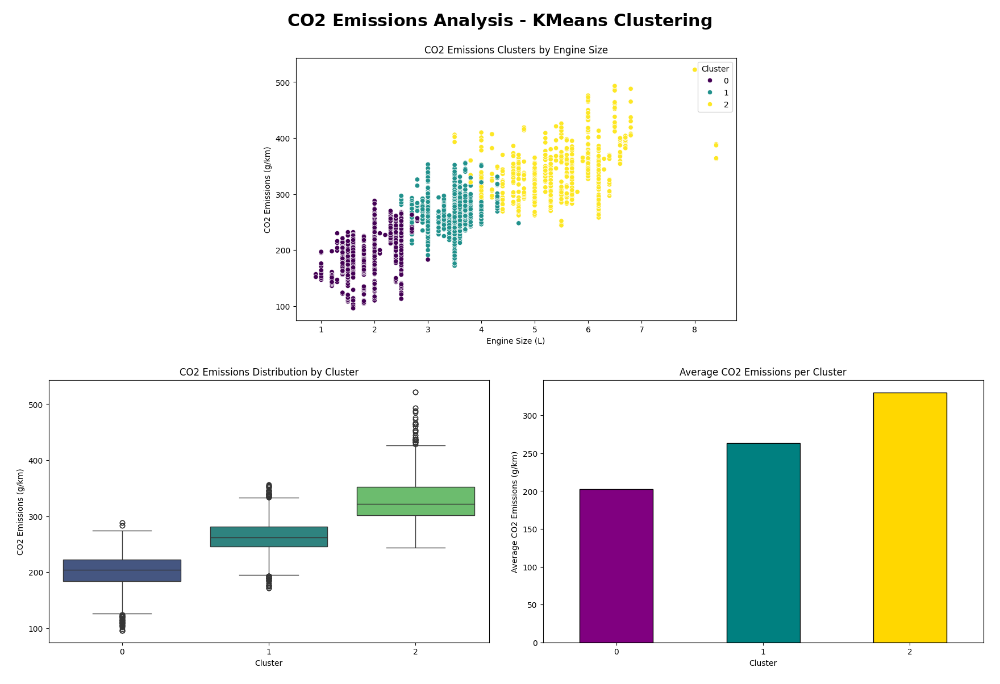

# CO2 Emissions Analysis - KMeans Clustering

## Project Overview
Analyzed 7,385 Canadian vehicle records using KMeans clustering to group vehicles by engine size, cylinders, and CO2 emissions. Completed as part of the York University Big Data Analytics Certificate (2024).

## Team Project
This was a group project for the York University Big Data Analytics Certificate (2024).

My contributions: I worked with my team on all stages of the project, including data preparation, analysis, and presenting findings.

In 2026, I re-ran and improved the analysis independently, making the cluster labels stable by renumbering clusters by average CO2 emissions.

## Tools Used
- Python
- Pandas
- Scikit-learn (KMeans, StandardScaler)
- Matplotlib
- Seaborn

## Key Insights

| Cluster | Vehicle Type | Vehicles | Avg Engine | Avg CO2 |
|---|---|---|---|---|
| Cluster 0 | Low Emission | 3,282 | 2.0 L | 202.9 g/km |
| Cluster 1 | Medium Emission | 2,562 | 3.4 L | 263.7 g/km |
| Cluster 2 | High Emission | 1,541 | 5.3 L | 330.5 g/km |

1. Larger engine size strongly correlates with higher CO2 emissions
2. High-emission vehicles produce about 63% more CO2 than low-emission vehicles
3. Low-emission vehicles make up the largest group, at 44% of all vehicles

## Dataset
CO2 Emissions Canada dataset from Kaggle (7,385 vehicles)

## View Full Project on Kaggle
https://www.kaggle.com/code/lalitacanada/co2-emissions-analysis-kmeans-clustering-york
